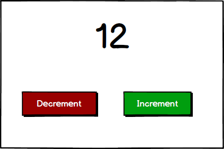

# Exercice d'échauffement

## Objectif:

Réaliser un compteur simple avec possibilité d'incrémenter et de décrémenter le compteur.

### Instructions:

- Cette exercice se fera dans le fichier `lib/find_number_web/live/counter_live.ex`
- Actions à réaliser:
  - initialiser le compteur
  - incrémenter la valeur
  - décrémenter la valeur
