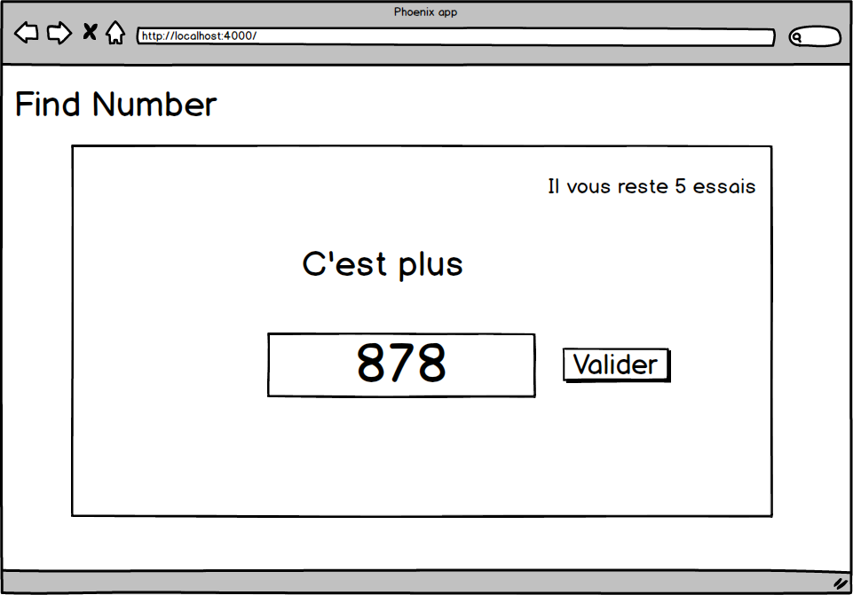

# Trouver le bon nombre

## Objectif:

Le but du jeu est de retrouver le nombre généré aléatoirement (entre 1 et 10 000) par le programme. L’utilisateur a droit à 10 essais au maximum. Si il réussit à trouver le bon nombre avant 10 essais, il a gagné. Sinon, il a perdu. Les instructions sont contenues dans le fichier `ECHAUFFEMENT.md`

### Challenges:

- Gérer une partie
- Afficher le nombre d’essais restants
- Réinitialiser la partie

### Bonus:

- Afficher l’ensemble des choix de l’utilisateur à la fin de la partie
- Mode 2 joueurs, où les 2 joueurs alternent, le premier qui trouve le bon nombre gagne la partie

### Instructions:

- Commencer par faire l'exercice d'échauffement
- Ensuite, enchainer avec cet exercice
- Cet exercice se fera dans le fichier `lib/find_number_web/live/find_number_live.ex`

Vous pouvez accéder à notre [petit guide LiveView](guides/LIVE_VIEW.md) pour trouver les lignes de codes nécessaires pour ce problème.

---

##### Installation:

Pour lancer le projet:

- Cloner le repo
- Installer les dépendances avec `mix deps.get`
- Installer les dépendances Node.js avec `cd assets && npm install`
- Lancer l'application avec `iex -S mix phx.server`

Maintenant, vous pouvez visiter [`localhost:4000`](http://localhost:4000) depuis votre navigateur.
